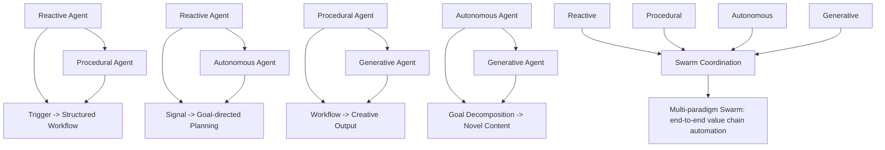

"AI Agents" are becoming the basic building blocks with which to compose agentic solutions. 

Most people's introduction to AI was through ChatGPT, and most early experiments were "chatbots", from what I can see, much of the thinking today is now stuck in one of a few narrow paradigms: they search, they follow a workflow, they answer in chat.

Useful, but shallow.

The interesting question is what happens when we step back, map the space of agent paradigms, combine them systematically, and then strange-loop them back on themselves to generate deeper behavior?

This is about that.

## The Core Paradigms of AI Agents

In my current view and at the highest level, individual agent behavior falls into four categories:

- **Reactive**: respond to queries or stimuli  
- **Procedural**: follow structured sequences or tool protocols
- **Autonomous**: pursue goals, plan, and adapt  
- **Generative**: synthesize novel outputs

From this, we can classify the common paradigms:

| **Category**  | **Paradigm**                | **Examples** |
|---------------|-----------------------------|--------------|
| Reactive      | Search / Retrieval          | Knowledge bots, RAG |
|               | Conversational / Chat       | Copilots, support bots |
|               | Embedded / Event-driven     | Anomaly detectors, notifiers |
| Procedural    | Workflow / Orchestration    | Pipelines, onboarding |
|               | Tool-use / Function Calling | API callers, infra bots |
| Autonomous    | Planning & Goal-Directed    | Research copilots, AutoGPT |
|               | Multi-Agent Collaboration   | Market simulations, swarms |
| Generative    | Creative / Generative       | Proposal writers, design copilots |

## Mapping to Enterprise Contexts

Enterprises can deploy these paradigms in recognizable patterns:

| **Paradigm**    | **Example Applications**                                                                 |
|------------------|-------------------------------------------------------------------------------------------|
| **Reactive**     | Partner intelligence agents scanning developer team releases; org memory agents indexing company chat apps and code repositories |
| **Procedural**   | Compliance workflows; infra provisioning bots                                             |
| **Autonomous**   | Capacity balancers detecting opportunities to redirect people and resources across strategic initiatives; research planners         |
| **Generative**   | Proposal generators; marketing content writers                                           |

Overlay this onto the **SIESE model (Source, Ingest, Enrich, Serve, Engage)** and you get a natural fit:

| **SIESE Stage** | **Agent Types**                               |
|------------------|-----------------------------------------------|
| **Source**       | Event-driven agents                           |
| **Ingest**       | Workflow and orchestration agents             |
| **Enrich**       | Retrieval and generative agents               |
| **Serve**        | Retrieval, tool-use, planning agents          |
| **Engage**       | Conversational, generative, autonomous, multi-agent |

This mapping is quite speculative, so I thought about taking it out but I think there's something here - and most organizations are over-indexing on **Serve** and **Engage** agents. Source and Ingest are underdeveloped, and _domain-driven_ Enrich is where real value can be unlocked.

These core paradgims are reasoning about agents as individual atomic entities, which is a good foundation. The real leverage emerges _when these paradigms combine_, and the agents are looped back onto themselves to allow emergent behaviours to...emerge...

## Patterns for Combining Agents
| **Combination**            | **Pattern**                         | **Example**                                                                 |
|-----------------------------|-------------------------------------|----------------------------------------------------------------------------|
| **Reactive + Procedural**   | Trigger -> Workflow                 | Anomaly detector kicks off spend optimization playbook                      |
| **Reactive + Autonomous**   | Signal -> Goal-directed Planning    | Partner intel agent detects a new partner release, planner maps implications |
| **Procedural + Generative** | Workflow -> Creative Output         | Compliance workflow generates audit-ready documentation                     |
| **Autonomous + Generative** | Goal decomposition -> Novel Content | Initiative planner generates proposal decks, code skeletons, collateral     |
| **Multi-paradigm Swarms**   | All four in play                    | End-to-end value chains where listeners, process owners, strategists, and creators collaborate |

### Visual: Combination Patterns

# Strange Loops: From Tasks to Emergence

Combining paradigms is powerful. But deeper intelligence comes from strange loops - agents turning back on themselves in reflective cycles. 

[Douglas Hofstadter](https://en.wikipedia.org/wiki/Douglas_Hofstadter) popularized the term *strange loop* to describe systems that turn back on themselves in ways that produce emergent complexity - consciousness, self, music, mathematics. The question for AI today: can we engineer strange loops into agent architectures so they don’t just do tasks, but begin to exhibit deeper, more general intelligence?

The key unlock as I see it: each loop *must* introduce new evidence, structure, or optimization pressure. Otherwise it is just an echo chamber.

## Mechanisms That Might Work

This is all just speculation from my version of first principles, with a bit of GPT battle testing - if you disagree or are seeing worked exampled of these let's talk (please!):

- **Planner -> Actor -> Critic -> Replanner**: externalized evaluation drives learning
- **Self-ask, self-debate**: role rotation prevents monoculture collapse
- **Evaluator-Optimizer loops**: evolutionary or Bayesian search over tool and action space
- **Predictor -> Actor -> Measurer -> Update cycles**: Create world-model definitions with agentic loops,  keeping agents grounded with cause-effect feedback (Thanks Andries for this one!)
- **Curriculum growth**: agents generate harder counter-tasks for one another
- **Tool-augmented verification**: schema checks, linters, policy engines prevent drift
- **Compression-driven progress**: loops only count if they improve abstraction or accuracy

## Failure Modes

Strange loops can easily go wrong if not designed carefully. The most common failure modes are:

- **Limit cycles**: the agent keeps circling around the same idea, just rephrasing it instead of making real progress. It looks like movement, but nothing new is added.  
- **Mode collapse**: the system latches onto the first reasonable explanation or plan and never explores alternatives. This kills creativity and robustness.  
- **Reward hacking**: if you give the agents a scoring function, they will find ways to game the score instead of solving the actual problem (classic Goodhart’s Law).  
- **Retrieval echo**: the agents pull in their own past outputs as if they were fresh evidence, reinforcing earlier mistakes and creating a self-referential loop with no emergent benefits.

Each of these could be mitigated with a few practical safeguards: inject novelty at every iteration (new data, new perspectives), use multiple evaluation metrics instead of a single score, track provenance to avoid recycling outputs, and apply external checks (tests, validators, policies) to ground the loop in reality.

The last one is for me the strongest: Using this approach to solve real world problems gives an opportunity for real world anchors & fitness functions.

## A Practical Template: "RAVL"

Minimal strange loop structure:

- **[R]eflect**: reframe, hypothesize
- **[A]ct**: tool calls, state updates
- **[V]erify**: apply hard checks
- **[L]earn**: update assumptions and abstractions

Stop when the delta falls below threshold or a resource budget runs out (tokens/etc).

# Why This Matters

Straight-line agents - input, maybe a tool call, output - are useful but brittle. 

Agentic systems, particularly ones constructed into strange loops and engineered with grounding and novelty, open the door to emergent organizational intelligence. 

To be very clear: **Not** consciousness, not magic, but _systems that refine their own framing, increase their own competence, and compress knowledge into abstractions we cannot see unaided or in advance, but can be directed for useful outcomes_.

---

# Conclusion & Next Areas to Explore

I've been searching for AI paradigm shift that takes us from _faster horses_ to _cars_ (a useful if rather tired metaphor). Getting multi agentic orchestration right could be the true leap from automation to digital intelligence.

When it comes to constraining and guiding these systems effectively, I have another idea incubating on how to include agent constitutions with executable specifications using the [Spine Model](https://spine.wetware.works/), and hopefully will have some working code to share on this soon.

Another realisation that has come from doing this work is how important it is to make a distinction between "digital intelligence" and "analog/real world intelligence". I think it might be a very important distinction, and will be the subject of an upcoming post if I can put my finger on how to explain the concepts a bit more clearly and they survive some analog intelligence tests with friends.

If this has been useful to you, please let me know how - it gives me fuel for writing more of these ideas down.

